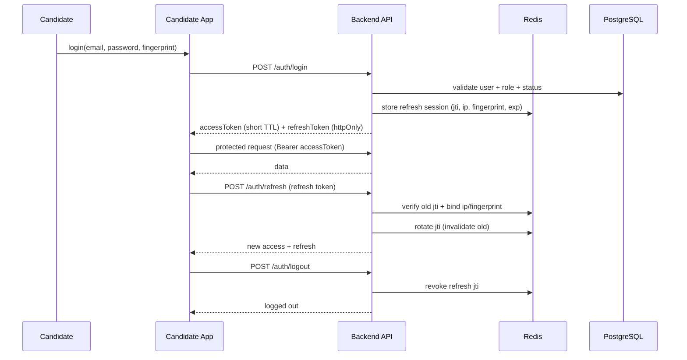
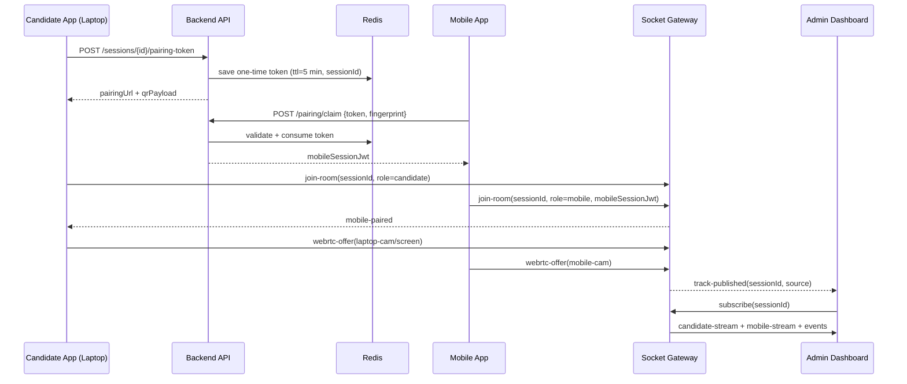

# System Architecture

## 1. High-Level Diagram

```mermaid
flowchart LR
  subgraph CandidateLaptop[Candidate Laptop App (React)]
    CUI[Exam UI + Anti-Cheat Hooks]
    CRTC[WebRTC: Webcam + Mic + Screen]
    CSIG[Socket.IO Signaling]
  end

  subgraph MobileCam[Mobile Proctor App (React/PWA)]
    MPAIR[QR Pairing]
    MRTC[WebRTC Rear Camera]
    MSIG[Socket.IO Signaling]
  end

  subgraph Backend[Backend (Node.js + Express)]
    API[REST API]
    WS[Socket.IO Gateway]
    RULES[Proctoring Rules Engine]
    SCORE[Auto Scoring + Overrides]
  end

  subgraph AI[AI Proctoring Engine (FastAPI + OpenCV/MediaPipe)]
    FACE[Face + Multi-face Detection]
    GAZE[Eye Gaze + Head Pose]
    AUDIO[Audio Violation Detection]
  end

  subgraph Data[Data Layer]
    PG[(PostgreSQL)]
    MONGO[(MongoDB)]
    REDIS[(Redis)]
    OBJ[(Encrypted Object Storage)]
  end

  subgraph Admin[Admin Dashboard (React)]
    GRID[Live Candidate Grid]
    ALERTS[Real-time Alerts]
    REVIEW[Timeline + Replay + Decision]
  end

  CUI --> API
  CSIG --> WS
  CRTC --> WS

  MPAIR --> API
  MSIG --> WS
  MRTC --> WS

  API --> PG
  API --> REDIS
  RULES --> MONGO
  WS --> MONGO

  RULES --> AI
  AI --> RULES
  RULES --> SCORE

  GRID --> WS
  ALERTS --> WS
  REVIEW --> API

  RULES --> OBJ
```

## 2. Data Responsibilities

- PostgreSQL stores transactional entities: users, exams, questions, sessions, answers, scores, admin actions.
- MongoDB stores high-volume proctoring events and stream metadata.
- Redis stores short-lived state: refresh-token sessions, WebRTC pairing tokens, anti-replay nonce data.
- Encrypted object storage holds screen/video artifacts referenced by event metadata.

## 3. Authentication Flow (JWT + Refresh Rotation)



## 4. Dual-Camera Pairing + Signaling Flow



## 5. Violation Pipeline

1. Client and signaling events produce raw monitoring signals.
2. Backend normalizes signals and forwards frames/audio snippets to AI engine.
3. AI engine returns detections with confidence and severity hints.
4. Rules engine applies thresholds/time windows to produce canonical violations.
5. Violations are saved in MongoDB and streamed to admins in real time.
6. Cumulative score can auto-submit or auto-flag a session.

## 6. Failure Handling

- Mobile network drop triggers reconnect loop with session resume token.
- Session heartbeat timeout marks stream as interrupted and raises a violation.
- If candidate leaves fullscreen/tab switches repeatedly, violation score increases.
- Submission endpoint is idempotent and server-timestamped.
